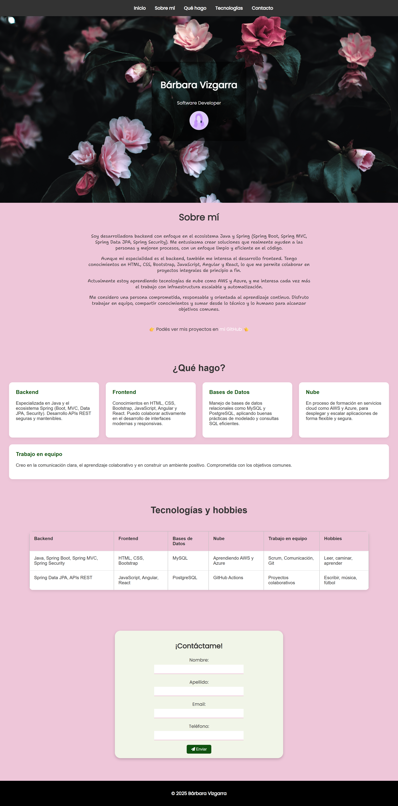

# 🌟 Portfolio Web - Bárbara Vizgarra

## 🚀 Tecnologías usadas

- HTML5
- CSS3

## 📌 Contenido del sitio

- **Presentación principal**: incluye mi nombre, rol profesional e ícono.
- **Enlace a GitHub**: para explorar mis proyectos públicos.
- **Tabla informativa**: muestra tecnologías conocidas, intereses de aprendizaje y pasatiempos.
- **Formulario de contacto**: sin funcionalidad aún, pero estructurado para capturar datos básicos.
- **Diseño responsive básico**: adaptado a diferentes tamaños de pantalla, desde móviles hasta escritorios.

## 👀 Vista previa

https://barviz.github.io/DSWF-portfolio-bv/

"

### 📫 Contacto

Podés encontrarme en [GitHub](https://github.com/barviz)

---
